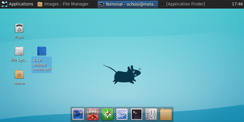

# Gnu/Linux course

Session 1

S.Mohammad Hoseini-Rad

[smhr.github.io](http://smhr.github.io/)
## History

### Gnu


* GNU is an operating system that is free software—that is, it respects users' freedom.
* Started in 1984 by Richard Stallman
* **What is Free Software?**
    * The freedom to run the program as you wish, for any purpose (freedom 0).
    * The freedom to study how the program works, and adapt it to your needs (freedom 1). Access to the source code is a precondition for this.
    * The freedom to redistribute copies so you can help your neighbor (freedom 2).
    * The freedom to improve the program, and release your improvements to the public, so that the whole community benefits (freedom 3). Access to the source code is a precondition for this.
    
### Linux


*  Linux is a Unix-like computer operating system assembled under the model of free and open-source software development and distribution. 
* It Started in 1991 by Linus Torvalds

### Gnu/Linux

* The Linux kernel alone does not form a working operating system
* Better to call it **Gnu/Linux**

### Why I use Gnu/Linux?

* It's FREE and secure
* It grows your creativity and computer knowledge
* Find many friends and help each other
* Best environment for programming (specially scientific)
* Forget antivirus
* Essential for one who want to pursue computational physics

# Distribution

### How to use Gnu/Linux in my computer?

* Linux kernel + Gnu tools + window system + desktop environment + additional softwares
* What is the difference?
* Many distributions
* Major are: Debian, Red Hat, Suse, Ubuntu, Mint, ...

--
#### Which one for our class?

* ubuntu
* Mint
* Repository on Ferdowsi university server: 
[http://repos.um.ac.ir/](http://repos.um.ac.ir/) ==> high speed downloading of necessary tools

### You can experience different desktops!

KDE


### Many desktops

Gnome


### Many desktops

Unity


### Many desktops

Xfce



### Many desktops

Cinnamon


### Installing packages (softwares)

* Package
* Repository

--
* Debian packages: .deb
* Red Hat packages: .rpm

### Installing packages in Debian based distros:

* Graphical approach:
   * ubuntu software center
   * Synaptic package manager
* Command-line approach:
   * ``apt-get install package-name``
   
### Shell & Terminal

* Shell is a program that takes commands from the keyboard and gives them to the operating system to perform.

--

* Terminal is a program that opens a window and lets you interact with the shell.

### code
Code:

```bash
echo salam
exit
```
use `$PWD`
